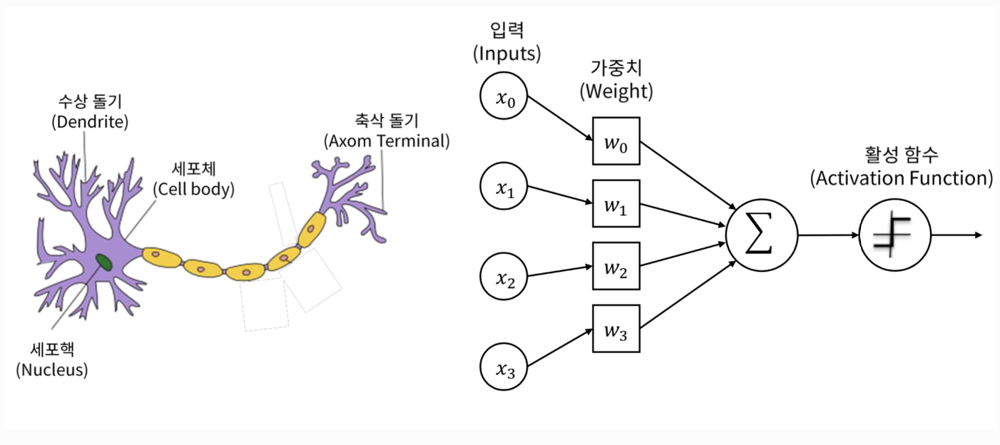

# 인공신경망의 역사와 퍼셉트론 모델

## 1세대: 인공신경망과 퍼셉트론의 등장 (1943~1986년)

### 인공신경망 (ANN, Artificial Neural Network)
- 인간의 뉴런 구조를 모방하여 만든 기계학습 모델입니다.
- 1943년, McCulloch와 Pitts가 제안한 논문에서 최초로 소개되었습니다.

### 퍼셉트론 (Perceptron)
- 1958년, Frank Rosenblatt이 제안한 선형 분류를 수행할 수 있는 피드포워드 네트워크입니다.
- 입력과 가중치의 곱의 합을 활성화 함수에 적용하여 출력을 생성합니다.



## 퍼셉트론의 작동 원리
1. **입력값과 가중치**: 각 입력값에는 가중치가 곱해져, 각 입력의 중요도를 반영합니다.
2. **합산 및 활성화 함수**: 가중치가 적용된 입력값들의 합에 활성화 함수를 적용해 최종 출력을 결정합니다.
3. **출력**: 활성화 함수의 결과를 바탕으로, 입력 데이터를 두 가지 클래스 중 하나로 분류합니다.

## Python 코드 예시

```python
import numpy as np

class Perceptron:
    def __init__(self, learning_rate=0.01, n_iters=1000):
        self.lr = learning_rate
        self.n_iters = n_iters
        self.activation_func = self._unit_step_func
        self.weights = None
        self.bias = None

    def fit(self, X, y):
        n_samples, n_features = X.shape
        self.weights = np.zeros(n_features)
        self.bias = 0

        y_ = np.array([1 if i > 0 else 0 for i in y])

        for _ in range(self.n_iters):
            for idx, x_i in enumerate(X):
                linear_output = np.dot(x_i, self.weights) + self.bias
                y_predicted = self.activation_func(linear_output)
                update = self.lr * (y_[idx] - y_predicted)
                self.weights += update * x_i
                self.bias += update

    def predict(self, X):
        linear_output = np.dot(X, self.weights) + self.bias
        return self.activation_func(linear_output)

    def _unit_step_func(self, x):
        return np.where(x >= 0, 1, 0)
```

## 퍼셉트론의 한계
- 마빈 민스키와 시모어 페퍼트는 1969년에 퍼셉트론이 XOR 문제와 같은 일부 간단한 비선형 문제를 해결할 수 없다는 것을 지적했습니다.
- 이 한계는 신경망 연구의 정체를 가져왔으며, 이후 다층 퍼셉트론과 역전파 알고리즘의 등장으로 극복되기 시작했습니다.

## 심층신경망 (Deep Neural Networks)으로의 전환
- 퍼셉트론의 한계를 극복하기 위해, 다층 구조와 역전파 알고리즘이 도입되었습니다.
- 이를 통해 신경망은 복잡한 비선형 문제를 해결할 수 있는 능력을 얻었고, 오늘날의 딥러닝으로 발전하게 되었습니다.
